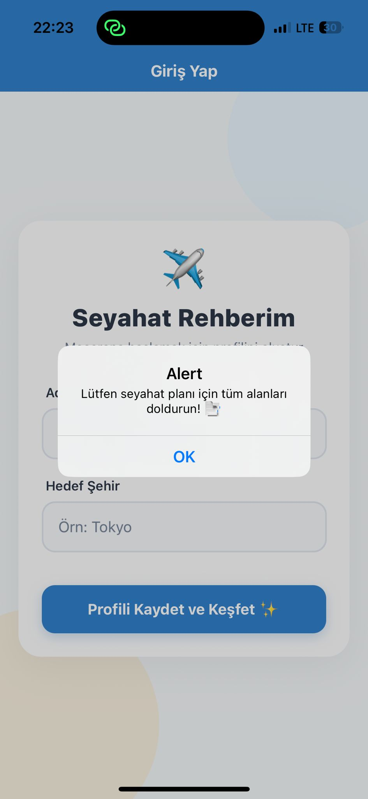
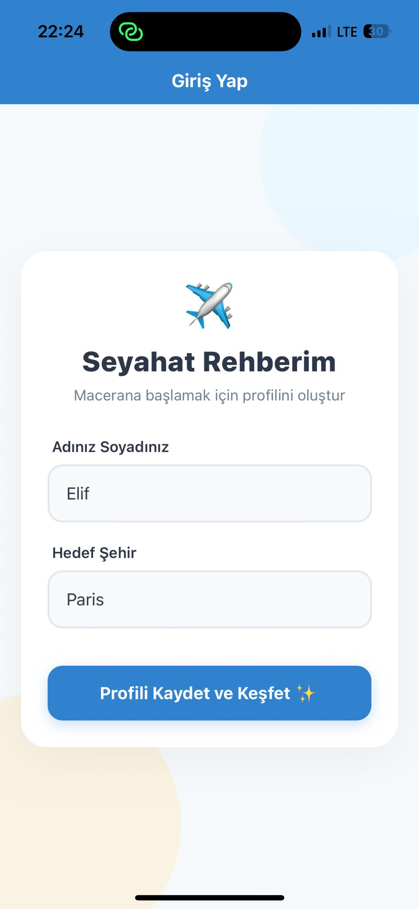
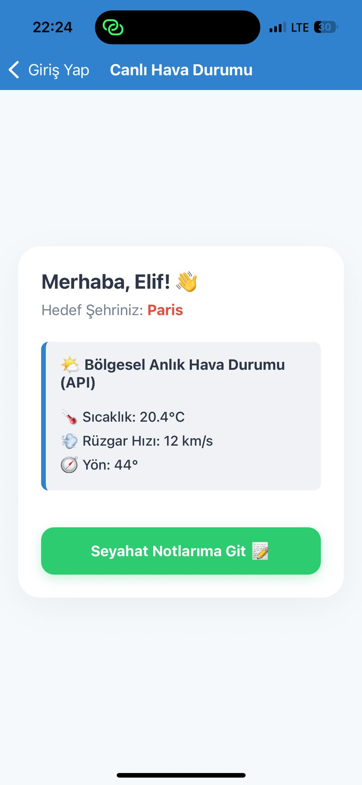
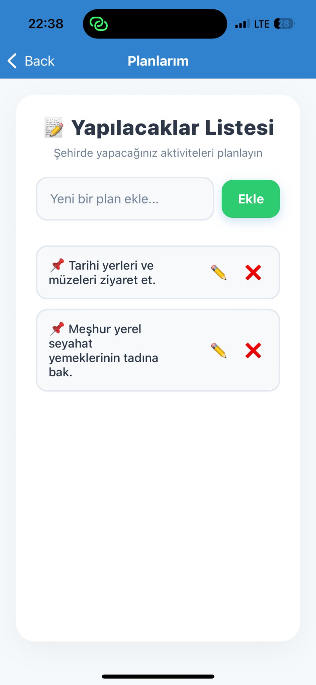
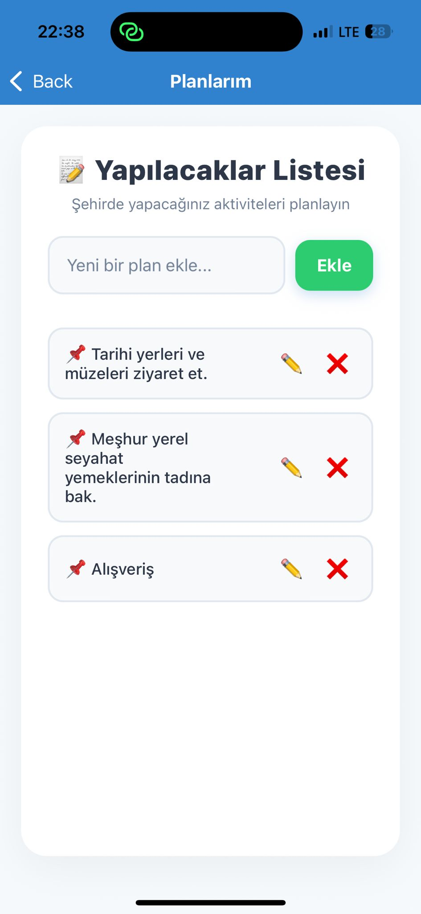
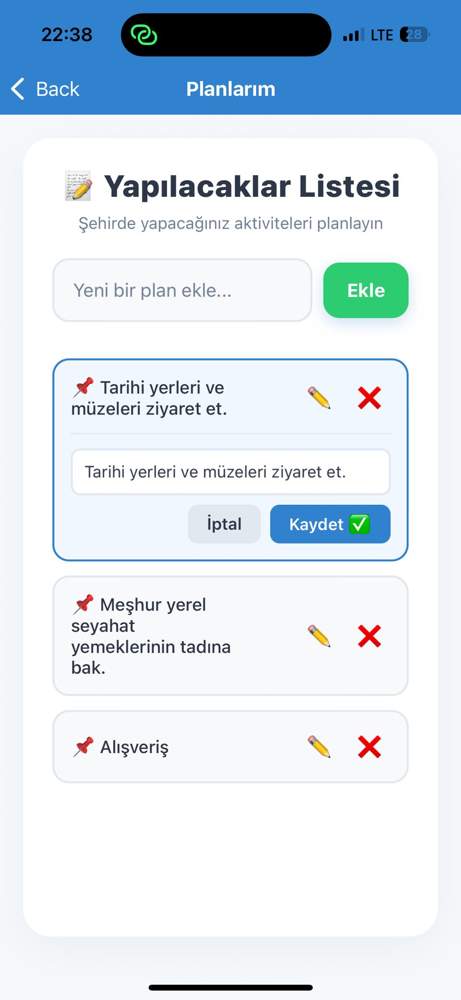

Merhaba hocam, uygulamayı Expo kullanarak React Native ile geliştirdim. Temel amacım, bir seyahate çıkmadan önce profil oluşturup, 
gideceğim şehrin hava durumunu görmek ve orada yapacaklarımı listeleyebileceğim bir rehber hazırlamaktı. 

Uygulamamız toplamda birbirine bağlı 3 farklı ekrandan oluşuyor:

1. Giriş sayfası
   * Burası uygulamanın açılış sayfasıdır. Kullanıcıdan isim-soyisim ve gitmek istediği şehri alıyoruz.
   * Alanlar boş bırakılmasın diye basit bir uyarı kontrolü ekledim.
   * Telefon klavyesi açılınca tasarım bozulmasın diye `KeyboardAvoidingView` kullandım.

2. Hava durumu api kullandığımız sayfa
   * Giriş ekranında yazdığımız isim ve şehir bilgilerini `AsyncStorage` kullanarak bu ekrana taşıdım ve hafızadan okuttum.
   * İnternetten canlı hava durumu verilerini çekerek ekranda sıcaklık ve rüzgar bilgilerini gösterdim.

3. Yapılacaklar sayfası
   * Seyahat esnasında yapılacak aktiviteleri ekleyip silebildiğimiz bir liste sayfası.
   * Listeleme için performanslı olan `FlatList` bileşenini tercih ettim.
   * Güncelleme Özelliği: Listede her elemanın yanında düzenle butonu var. Buna basınca hemen o elemanın altında küçük bir alan
   * açılıyor ve planı değiştirebiliyoruz. Yanındaki sil butonu ile de silebiliyoruz.

--Kullandığım Teknolojiler

* Framework:React Native (Expo)
* Sayfa Geçişleri: React Navigation (Stack Navigator)
* Hafıza/Veri Kaydetme: AsyncStorage
* Tasarım: Projenin renkleri ve kutu tasarımları tek bir yerden yönetilsin diye ana dizinde `Styles.js` adında ortak bir stil dosyası oluşturdum.

-- Bilgisayarda Nasıl Çalıştırılır?

1. Proje klasörünü bilgisayarınıza indirin.
2. Klasörün içinde terminali açıp gerekli paketleri yüklemek için `npm install` yazın.
3. Projeyi başlatmak için `npx expo start` komutunu çalıştırın.
4. Telefonunuza Expo Go uygulamasını indirip ekrandaki QR kodu taratarak uygulamayı test edebilirsiniz. 

--Proje ekran fotoğrafları

1. 
2. 
3. 
4. 
5. 
5. 
